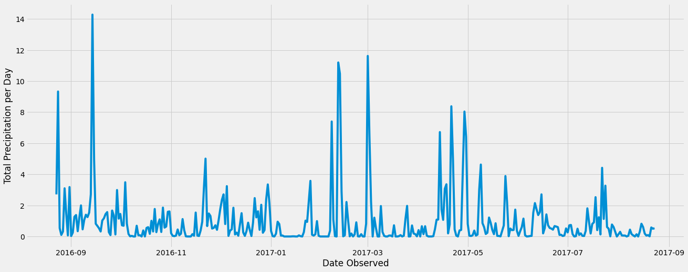
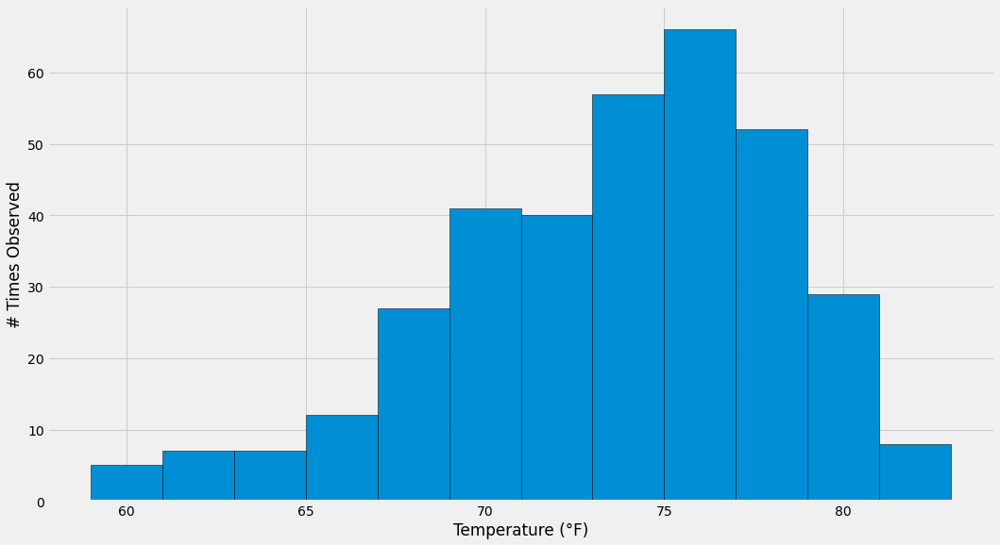

# sqlalchemy-challenge

### Robert Lane

## Hawai'i Climate Exploratory Analysis

Below is a chart which shows daily precipitation totals for the last year of recorded data in the dataset.  The dryest time of year recorded seems to generally be from October through January, but more years should be included if the point would be to infer a prediction.

Next is a temperature histogram, which will help show which temperature ranges are mose frequently recorded.  As shown below, the most common temperatures occur between 73 and 79 °F.  Approximately 90% of recorded temperatures are between 67 and 81 °F.

## Climate API Access

### Instructions

1. Load PythonData environment if necessary.  Your python environment needs to include flask, sqlalchemy, and nympy.

2. Run "python app.py" in a terminal or Git Bash.

3. Open localhost:5000 in a browser

The first page lists available routes, and returns data in JSON format.  Data provided in this API is as follows:

* **/api/v1.0/precipitation** : lists all precipitation recorded in the database for the most recent year in the database, grouped and ordered by date.

* **/api/v1.0/stations** : lists all stations by station ID.

* **/api/v1.0/tobs** : lists all temperatures observed within the last year in the database, ordered by date.  Only the station with the most measurements recorded in the set is used.

* **/api/v1.0/<start>** : same as below, but the default end date is the last date recorded in the set.

* **/api/v1.0/<start>/<end>** : dates must be formatted as 'yyyy-mm-dd' , although the hyphens may be omitted.  Returns mean (TAVG), maximum (TMAX), and minimum (TMIN) temperatures for the ranges requested.

## Temperature Analysis

### I

Here, the goal is to compare temperature averages between June and December for all years within the dataset.  June's mean temperature is 74.89°F, whereas December's mean temperature is 70.93°F.  When running a t-test on the two subsets of temperatures, the p-value is 6.62 x 10^-178.  This supports the alternative hypothesis that the two sets have a statistically significant difference in temperature.  In other words, it is very unlikely that the average temperatures are likely to overlap.

### II

For the calendar year of 2011, the temperature ranges are as follows:

* Min: 56°F
* Mean: 72.7°F
* Max: 86°F

Below is a bar chart representing this data.

The planned trip dates are 2016-08-01 through 2016-08-07.  For the previous year, the average rainfall per weather station was 1.93 inches per day.

Finally, below shows the minimum (tmin), maximum (tmax), and mean (tavg) temperatures for each planned trip date for all calendar years within the dataset.

